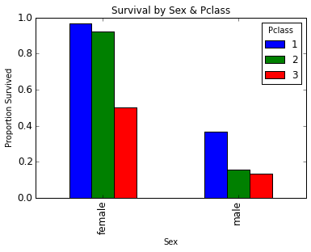

# analyze-Titanic-dataset

## "Analyze a Dataset"
### Project 2 of Udacity's _Data Analyst Nanodegree_ program.

This was an exploratory data analysis that attempts to answer the question:  
_**"What factors, or combination of factors, made people more likely to survive the sinking of the Titanic?"**_  

Based on the _HMS Titanic_ data set, [as seen on **Kaggle**](https://www.kaggle.com/c/titanic).  

Written in Python / Pandas and marked up in a Jupyter Notebook. The notebook can be viewed in its entirety in the file **Project_2_Data_Analysis.ipynb**

Demonstrates an introductory-level understanding of data analysis with Pandas and Numpy, visualization, and working with Jupyter (Ipython) notebooks. (Along with some simple Python.)

